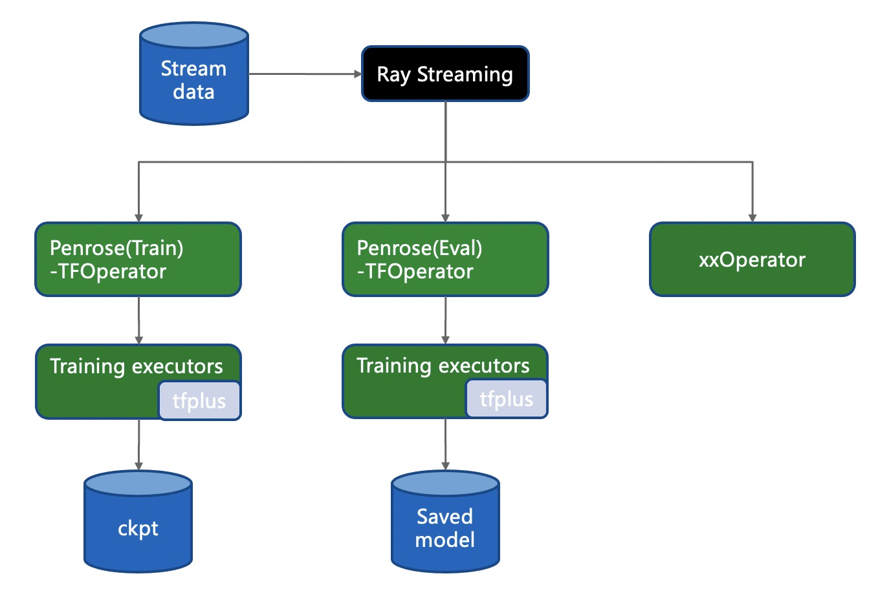

[](streaming/assets/infinite.svg)

Mobius : Online Machine Learning. ============
[Mobius](https://tech.antfin.com/products/ARCMOBIUS) is an AI infra
platform including realtime computing and training.

Ray Streaming
=============

Ray Streaming is a data processing framework built on ray.

Key Features
------------

*   **Cross Language**. Based on Ray\'s multi-language actor, Ray
    Streaming can also run in multiple languages(only Python and Java is
    supported currently) with high efficiency. You can implement your
    operator in different languages and run them in one job.

*   **Single Node Failover**. We designed a special failover mechanism
    that only needs to rollback the failed node it\'s own, in most
    cases, to recover the job. This will be a huge benefit if your job
    is sensitive about failure recovery time. In other frameworks like
    Flink, instead, the entire job should be restarted once a node has
    failure.

*   **AutoScaling**. (Moved from internal in the future). Generate a new
    graph with different configurations in runtime without stopping job.


*   **Fusion Training**. (Moved from internal in the future). Combine
    TensorFlow/Pytorch and streaming, then building an e2e online
    machine learning pipeline.

Examples
--------

### Python

```python
import ray
from ray.streaming import StreamingContext

ctx = StreamingContext.Builder() \
    .build()
ctx.read_text_file(__file__) \
    .set_parallelism(1) \
    .flat_map(lambda x: x.split()) \
    .map(lambda x: (x, 1)) \
    .key_by(lambda x: x[0]) \
    .reduce(lambda old_value, new_value:
            (old_value[0], old_value[1] + new_value[1])) \
    .filter(lambda x: "ray" not in x) \
    .sink(lambda x: print("result", x))
ctx.submit("word_count")
```

### Java

```java
StreamingContext context = StreamingContext.buildContext();
List<String> text = Collections.singletonList("hello world");
DataStreamSource.fromCollection(context, text)
    .flatMap((FlatMapFunction<String, WordAndCount>) (value, collector) -> {
        String[] records = value.split(" ");
        for (String record : records) {
            collector.collect(new WordAndCount(record, 1));
        }
    })
    .filter(pair -> !pair.word.contains("world"))
    .keyBy(pair -> pair.word)
    .reduce((oldValue, newValue) ->
            new WordAndCount(oldValue.word, oldValue.count + newValue.count))
    .sink(result -> System.out.println("sink result=" + result));
context.execute("testWordCount");
```

### Use Java Operators in Python

```python
import ray
from ray.streaming import StreamingContext

ctx = StreamingContext.Builder().build()
ctx.from_values("a", "b", "c") \
    .as_java_stream() \
    .map("io.ray.streaming.runtime.demo.HybridStreamTest$Mapper1") \
    .filter("io.ray.streaming.runtime.demo.HybridStreamTest$Filter1") \
    .as_python_stream() \
    .sink(lambda x: print("result", x))
ctx.submit("HybridStreamTest")
```

### Use Python Operators in Java

```java
StreamingContext context = StreamingContext.buildContext();
DataStreamSource<String> streamSource =
    DataStreamSource.fromCollection(context, Arrays.asList("a", "b", "c"));
streamSource
    .map(x -> x + x)
    .asPythonStream()
    .map("ray.streaming.tests.test_hybrid_stream", "map_func1")
    .filter("ray.streaming.tests.test_hybrid_stream", "filter_func1")
    .asJavaStream()
    .sink(value -> System.out.println("HybridStream sink=" + value));
context.execute("HybridStreamTestJob");
```

Training
--------

Training solution is one of the major topics for online machine learning
systems, different from the traditional batch training approach, online
training needs to learn from infinite streaming data, with high
stability and performance for both system and algorithm level.

[](training/assets/training_infra.jpg)

Key Features
------------

*   **Elastic**. Both ps and worker level elastic during long term
    running, support dynamic networking for new node add and remove
    without restart job.

*   **Single Node Failover**. Based on ray streaming\'s capability of
    Single Node Failover, dynamic networking support single-node
    failover without restarting the entire job.

*   **Large scale sparse embedding**. Provide add-ones of tensorflow,
    support training with large scale and elastic sparse embedding
    features.

*   **Streaming input support**. A general dataset creator to support
    all data sources as backend, including both streaming and batch
    data.

*   **Algorithm toolkits for online learning**. An algorithm toolkit to
    help the long-term training models keep converging.

*   **Validation for continuous model delivery**. A validation mechanism
    to help our system keep delivering high-quality models and intercept
    all the abnormal models.

Getting Involved
----------------

-   [Forum](https://discuss.ray.io/): For discussions about development,
    questions about usage, and feature requests.
-   [GitHub Issues](https://github.com/ray-project/mobius/issues): For
    reporting bugs.
-   [Slack](https://ray-distributed.slack.com/archives/C032JAQSPFE):
    Join our Slack channel.
-   [StackOverflow](https://stackoverflow.com/questions/tagged/ray-mobius):
    For questions about how to use Ray-Mobius.

