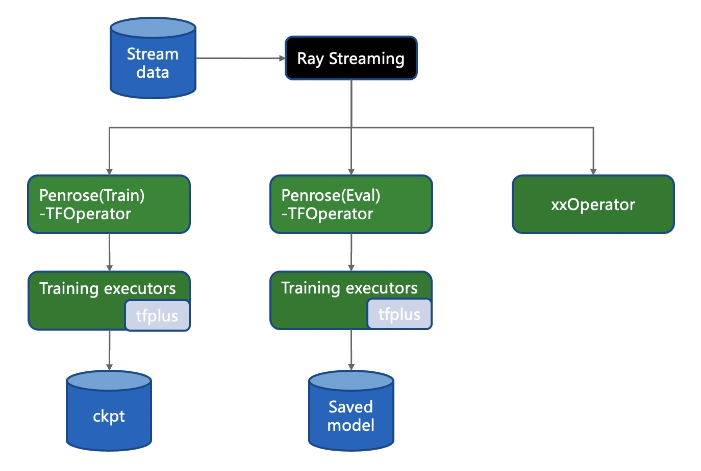
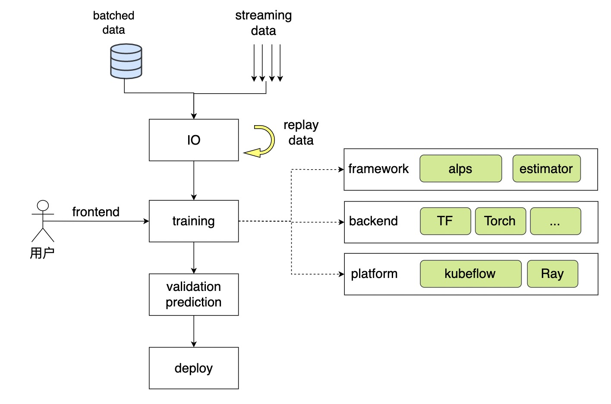
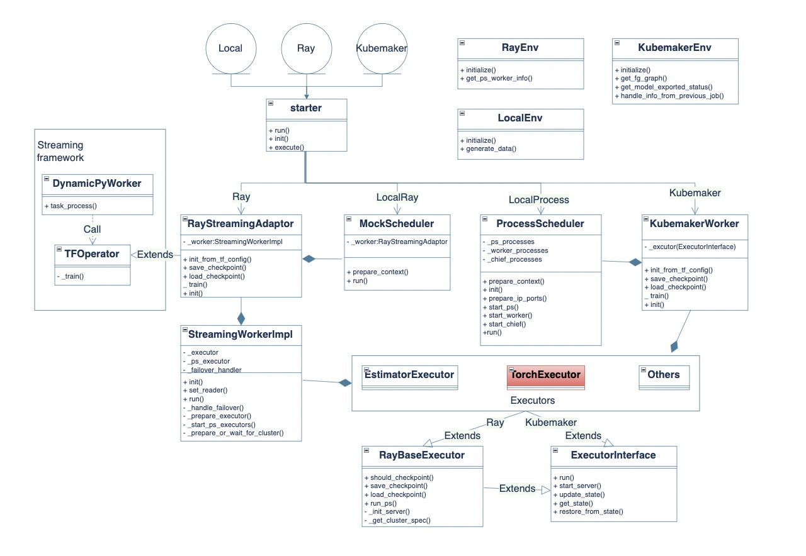

=============
Online Training
=============

Training solution is one of the major topics for online machine learning systems, different from the traditional batch training approach,
online training needs to learn from infinite streaming data, with high stability and performance for both system and algorithm level.

As shown in above diagram, we have 3 major components in our online training architecture:
 - Penrose
 - Training executors (i.e. estimator_executor)
 - Customized ops (i.e. tfplus)

Penrose
============
Penrose act as an training middle tier between explicit training framework and external environments， and datasource. High level architecture as below:

It implements the interface provided by ray streaming like TFOperator, which make sure the training framework can be invoked by ray streaming, then explicit training framework is invoked by dedicated executors, actually we hope ray streaming is one of the external environments we want to support, we hope it's transparent to the training code, and let users focus on their model.

Above diagram shows the basic uml for penrose, penrose handles below stuffs:
 - adapt runtime environments to explicit trainer.
 - adapt runtime data source to explicit trainer, standard dataset will feed to trainer.
 - prepare external config and cluster info to trainer to construct networking and model training.

Training executors (i.e. estimator_executor)
============
This component provides dedicated trainers which can be based on tensorflow and pytorch and even other frameworks, user just needs to implement an executor if necessary, it's designed quite open and flexible.

Customized ops (i.e. tfplus)
============
This part is optional to users, sometimes our training framework does not meet our requirements, just like dynamic large scale sparse embedding, usually we need to update the kernel ops to achieve this.
